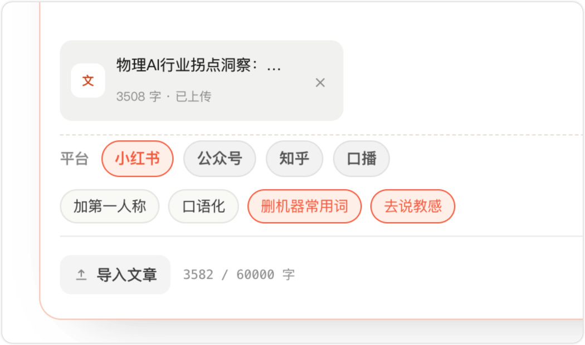
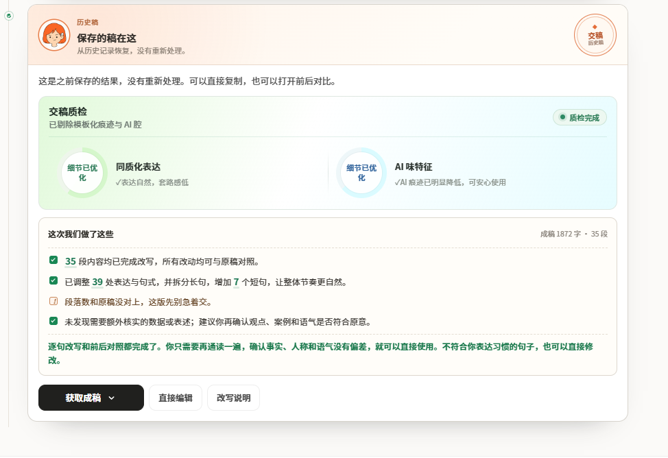
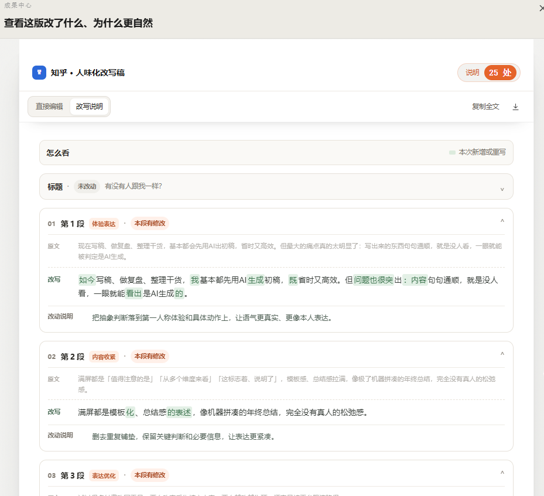
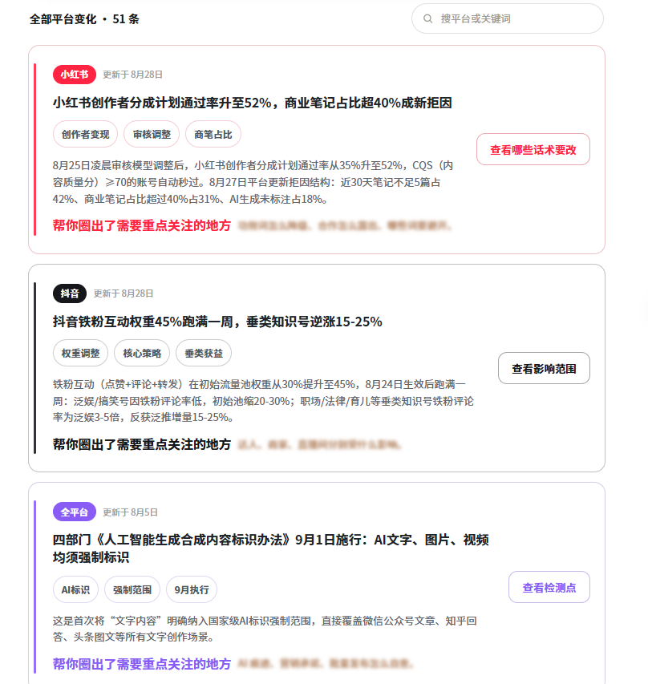
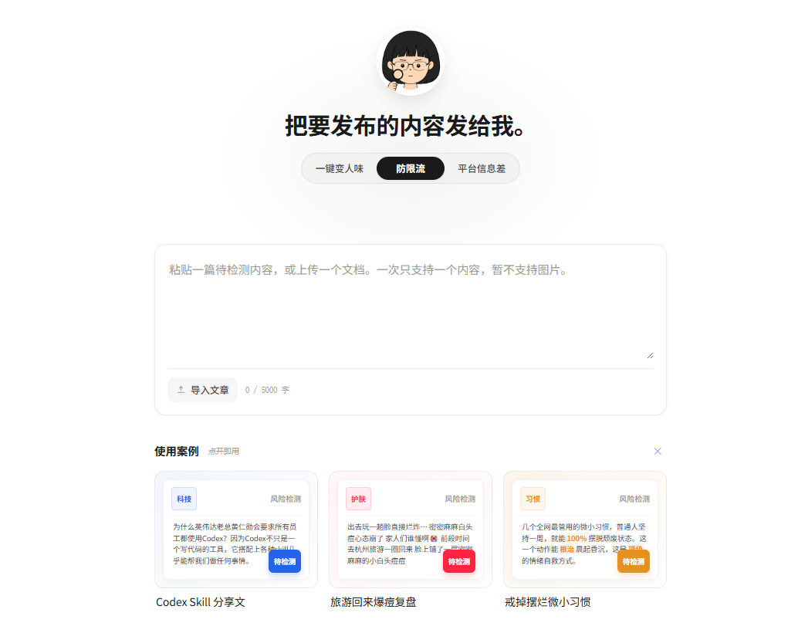

# 稿子机器感太重被限流？学会去除 AI 写作痕迹，流量稳步回升

## 一、你的AI稿之所以没流量，根本不是选题问题

现在做内容，几乎所有人都会用AI快速出初稿、搭内容框架，效率确实翻倍。

但大家也会发现，自己勤勤恳恳日更，选题、配图、干货都没问题，可就是没推荐、没播放、互动惨淡。

很多人第一反应就是改选题、换封面、调排版，其实完全找错方向了！

真正拖垮数据的元凶，是**文案AI写作痕迹过重**，被平台判定为流水线低质AIGC内容，直接压低分发权重。

## 二、藏在文章框架里的AI痕迹，90%的人都发现不了

AI写作有一套刻在骨子里的固定套路，那就是万能总分总嵌套结构，也是最容易被平台抓取的AI特征。

开篇统一铺垫总观点、中间分段刻板展开、结尾强行总结升华；就连每一个小标题下面，都严格死守“是什么、为什么、怎么做”的固定模板。

这种流水线写法，读者读两段就能预判全文内容，没有任何阅读惊喜，观感枯燥又生硬。

更关键的是，平台算法对这类模板化内容极其敏感，大概率直接限流降权。

对于新手创作者来说，手动拆解、重构整篇文章框架难度很高，很容易改崩逻辑、越改越差。

所以，想要稳妥高效解决问题，借助专业工具优化是最省心的选择。

## 三、我自用的高效方案：小橡皮AI一键去机器味

试过无数**消除ai痕迹网站**和各类改写工具后，我日常批量出稿、清洗AI痕迹，一直稳定复用的就是**小橡皮AI**，适配所有自媒体平台，新手零门槛上手。

传送门：[小橡皮](https://xiangpiai.cn/workspace?from=github0901jw)[https://xiangpiai\.cn/](https://xiangpiai.cn/workspace?from=github0901jw)

它和普通洗稿工具最大的区别就是：不做无脑换词、不搞表面改写，主打**一键变人味**深度重构。

做多账号运营的朋友都懂它的优势：支持小红书、抖音、视频号、公众号、知乎多平台文风一键切换，不用逐平台手动改稿，可以规避全网通稿导致的同质化限流，大幅提升改稿效率。

而且它的每一处修改点位、优化原因都会清晰标注，不合适的改动可以直接撤回，还能自主补充个人观点和实操感悟。

如果你对AI痕迹不敏感，还可以根据它的修改来学习怎么识别AI痕迹，从而提高自己的辨别能力。

还有一个很多人忽略的隐形限流大坑：不少人明明把**ai味**清理干净了，发文依旧降权、没流量。

这个的问题就不在AI痕迹了，而是AI稿自带大量隐性极限词、营销话术和敏感词汇，肉眼根本排查不干净，或者是触犯了一些平台的规则红线，你也可以在小橡皮这里找到规则解读。

同时，小橡皮AI自带全平台风控筛查功能，一键扫描全文、标记风险内容、给出合规替换方案，同时搞定**去ai痕迹**和发文合规两大难题，特别适合规则不熟悉的新手。

## 五、批量出稿零翻车SOP流程

分享一套我长期复用、稳定过审的标准化出稿流程：

1、用AI快速生成初稿，不用纠结细节、不用反复调试复杂**去ai味提示词**，先搭好完整内容框架即可；

2、将文稿导入小橡皮AI，根据发布平台匹配对应文风，一键重构真人语感，深度洗掉机器感、**消除ai痕迹**；

3、对照可视化修改记录，手动微调细节，保留专属个人写作风格，避免文案同质化；

4、开启全平台防限流风控扫描，整改所有违规、极限、敏感话术，规避发文风险；

5、通篇通读润色语感，确认无生硬机器感、逻辑通顺后，定稿发布。

## 六、最后总结

现在的自媒体赛道，不用AI很难跟上日更节奏，但只会用AI出稿、不会**怎么降ai痕迹**、**怎么去掉ai痕迹**，永远做不出高流量爆款。

别再盲目搜罗各类**消除ai痕迹网站**、浪费时间测试参差不齐的**免费去除ai痕迹**工具、死磕效果微弱的网上指令。

找对方法、用对工具，AI负责高效搭框架，小橡皮负责深度去机器感，再辅以简单人工微调，就能持续产出平台高推荐、读者爱看的真人质感内容啦！

